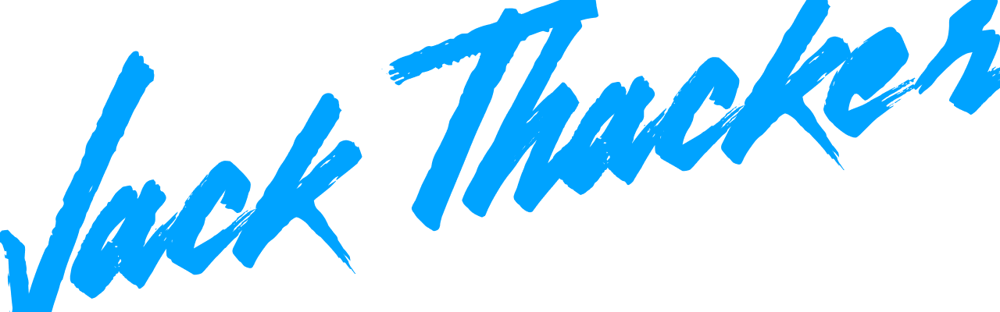

## Hi, my name's Jack 👋

I'm a junior software developer based in Sheffield, UK

[](https://www.linkedin.com/in/jack-thacker-b568b11b4/)

```javascript
jack = {
  firstName: "Jack",
  lastName: "Thacker",
  background: "PhD in English Literature",
  training: "Self-paced Software Development Course with _nology.io",
  strengths: ['creative', 'quick learner', 'great communicator']
}
```

I’m a junior web developer specializing in the front end (but don’t worry, I have a few back end tricks up my sleeve as well). I recently completed a part-time software developer course with _nology.io and I’m now proficient in Javascript (ES6), React, CSS/SCSS and HTML5 and familiar with range of key approaches such as OOP, TDD and Agile.

I’m looking to develop my skills further in a fulfilling front end role in the Tech sector, where I hope to apply my creative flair and people skills, as well as my technical experience, to produce impactful and beautiful applications. 

I have a background in academia and the humanities, which means that I'm an exceptionally strong critical thinker and communicator, and I tend to bring an element of original thinking and creative flair to any project that I’m a part of. 

I can boast a growing portfolio of project that make use of a range of in-demand technologies. Check out what I've been learning and working on below!

## Technologies / Skills


